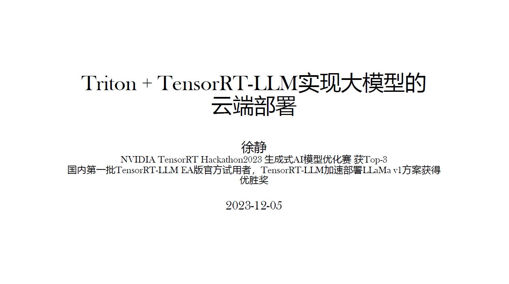
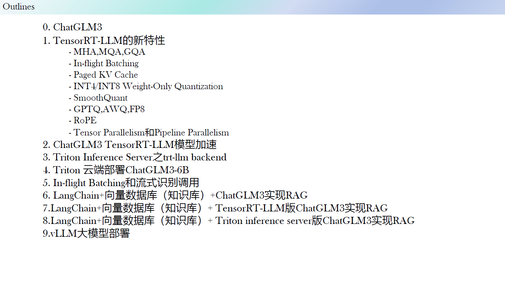

## 大模型加速部署：TensorRT-LLM, Triton Inference Server, vLLM, LangChain

### 基于ChatGLM3

+ ChatGLM3-6B的模型解析和HF部署（流式，非流式）
+ TensorRT-LLM的特性，安装以及大模型部署（流式，非流式）
+ Triton Inference Server的trtllm-backend, vllm-backend的部署
+ vLLM特性，安装及大模型部署
+ Langchain实现RAG(ChatGLM3-6B)
+ Langchain+TensorRT-LLM实现RAG
+ Langchain+Triton Inference Server实现RAG
+ Langchain+vLLM实现RAG

关于详细的slide介绍，请在issue中索要！